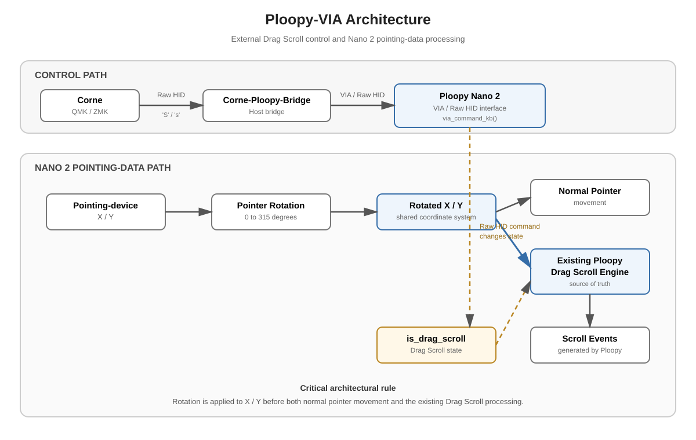

# Ploopy-VIA

Custom QMK/VIA firmware for the **Ploopy Nano 2 Rev2.003**.

This repository extends the existing Ploopy firmware with a configurable **VIA / Raw HID interface**, **Scroll Lock / Drag Scroll integration**, **pointer rotation**, **Scroll Speed configuration**, and **DPI configuration**.

### VIA Configuration

The Nano 2 exposes all three user-configurable settings directly under **Ploopy Settings** in VIA:

- **Rotation**
- **Scroll Speed**
- **DPI**

These settings are persistent and can be changed through VIA without rebuilding the firmware.

The project is designed around a single Nano-2 firmware configuration. The different functions are integrated into the same firmware rather than maintained as separate keymaps.

---

## Current Features

The current Nano-2 firmware provides:

* **VIA support**
* **Raw HID support**
* **Scroll Lock / Drag Scroll control**
* **Scroll Lock LED state integration**
* **Configurable pointer rotation**
* **Persistent rotation configuration through VIA EEPROM**
* **Configurable Scroll Speed through VIA**
* **Persistent Scroll Speed configuration**
* **Configurable DPI through VIA**
* **Persistent DPI configuration**
* **VIA device definition for the Nano 2**

The firmware is based on the existing Ploopy pointing-device implementation rather than replacing it.

---

# Architecture

The project has three related paths:

1. **Control path** - the Corne and `DragScroll-HID` control the Ploopy's Drag Scroll state through Raw HID.
2. **Scroll Lock / LED state path** - the common Ploopy firmware receives the host Scroll Lock LED state through `led_update_kb()` and uses `led_state.scroll_lock` to update `is_drag_scroll`.
3. **Pointing-data path** - the Nano 2 transforms the pointing-device X/Y coordinates before they enter the existing Ploopy processing.

The important architectural requirement is that **pointer rotation is applied to the pointing-device X/Y coordinates before they reach the existing Ploopy processing**.

This means that normal pointer movement and Drag Scroll operate in the same rotated coordinate system.

The Raw HID control path does not directly implement the Drag Scroll engine. The bridge sends a command to the Nano 2, and the Nano 2 updates `is_drag_scroll`. The common Ploopy firmware also maps the host Scroll Lock state to `is_drag_scroll` through `led_update_kb()`, so the host Scroll Lock state remains integrated with the existing Drag Scroll mechanism. The existing Ploopy Drag Scroll engine then uses `is_drag_scroll` as its state.

The project deliberately keeps the existing Ploopy Drag Scroll engine as the source of truth rather than creating a second implementation.

---

# Ploopy Nano 2

The Nano 2 firmware is based on the Ploopy Nano 2 Rev2.003 QMK keyboard definition:

`keyboards/ploopyco/nano_2/rev2_003/`

The custom firmware uses a single keymap:

`keyboards/ploopyco/nano_2/rev2_003/keymaps/default/`

The custom keymap contains the integrated functionality for:

* VIA
* Raw HID
* Drag Scroll / Scroll Lock control
* Pointer rotation
* Scroll Speed configuration
* DPI configuration

---

# VIA

The Nano 2 firmware is configured for VIA.

The VIA device definition is:

`_Firmware/Nano-2/nano2.json`

This definition describes the Nano 2 to VIA and allows the firmware's keymap and custom keycodes to be configured through the VIA interface.

### Ploopy Settings

The **Ploopy Settings** menu in VIA provides the three configurable firmware settings:

* **Rotation**
* **Scroll Speed**
* **DPI**

These settings are persistent and can be changed through VIA without rebuilding the firmware.

### Nano-2 Button / Key Assignment

The Nano-2 button can also be assigned through the VIA keymap to specific functions:

* **DPI Config**
* **Scroll Speed**
* **Drag Scroll**

These assignments provide direct control of the corresponding functions from the Nano-2 button.

**Rotation is configured through Ploopy Settings and is not a Nano-2 button assignment.**

The VIA custom keycodes are:

* **DPI Config**
* **Drag Scroll**
* **Scroll Speed**

The dropdown settings and the corresponding custom keycodes operate on the same underlying firmware functionality where applicable.

# Scroll Lock / Drag Scroll

The Ploopy firmware already contains the actual Drag Scroll implementation.

This project does **not** replace the Ploopy Drag Scroll engine.

Instead, the custom firmware provides an external control path that changes the existing Ploopy Drag Scroll state.

The control flow is:

`Keyboard -> Raw HID -> via_command_kb() -> is_drag_scroll -> Existing Ploopy Drag Scroll`

The Raw HID protocol uses two command bytes:

* `'S'` (`0x53`) -> Drag Scroll ON
* `'s'` (`0x73`) -> Drag Scroll OFF

This allows the Corne and the Ploopy to communicate using a very small and stable protocol.

---

# Scroll Lock LED

The Scroll Lock state is integrated at the common Ploopy firmware level.

The implementation is located in:

`keyboards/ploopyco/ploopyco.c`

The existing Ploopy LED update hook receives the host Scroll Lock state and updates `is_drag_scroll` accordingly.

This connects the host's Scroll Lock state to the Ploopy's existing Drag Scroll mechanism.

The project therefore does not create:

* a second Drag Scroll engine
* a separate Scroll Lock implementation
* a separate LED system

Instead, it reuses the functionality already present in the Ploopy firmware.

The Scroll Lock / Drag Scroll behavior has been **tested and confirmed working on the Nano 2**.

---

# pointer rotation

The firmware provides configurable rotation of the pointing-device coordinates.

The supported angles are:

* **0 degrees**
* **45 degrees**
* **90 degrees**
* **135 degrees**
* **180 degrees**
* **225 degrees**
* **270 degrees**
* **315 degrees**

Rotation is applied to the X/Y coordinates before normal Ploopy pointing-device processing.

For example, the 90-degree rotation uses:

`X' = Y`

`Y' = -X`

The 45-degree rotations use an integer approximation of `1 / sqrt(2)` suitable for the microcontroller.

The rotation implementation is part of the main Nano-2 firmware rather than a separate keymap.

---

# Rotation Configuration

The selected rotation is configurable through VIA.

The rotation value is stored using VIA's custom EEPROM configuration:

`VIA_EEPROM_CUSTOM_CONFIG_SIZE = 1`

This allows the selected rotation to persist across firmware restarts.

The firmware can therefore retain the user's selected physical orientation without requiring the rotation to be hard-coded into the firmware.

Rotation can be changed through the **Ploopy Settings -> Rotation** VIA dropdown.

The firmware also contains internal rotation keycodes used by the keymap implementation, but the VIA device definition exposes the configuration through the Rotation dropdown rather than as additional VIA custom keycodes.

---

# Scroll Speed

The Nano 2 firmware provides configurable Drag Scroll speed.

Scroll Speed is implemented by changing the runtime scaling used by the existing Ploopy Drag Scroll engine.

The original Drag Scroll implementation remains responsible for generating the scroll events.

The available settings are:

* **Normal**
* **Slow**
* **Slower**
* **Fast**
* **Faster**

Scroll Speed can be changed in two ways:

* through the **Ploopy Settings -> Scroll Speed** VIA dropdown
* through the **Scroll Speed** VIA custom keycode

The custom keycode cycles through the available speed settings.

The selected Scroll Speed is stored in the Nano-2 user configuration and is restored when the firmware starts.

The VIA setting and the custom keycode therefore control the same underlying runtime setting.

The implementation intentionally does not replace or duplicate the existing Ploopy Drag Scroll engine.

No internal Scroll Speed divisor values are exposed in the documentation because those are implementation details and may change independently of the user-facing settings.

---

# DPI Configuration

The Nano 2 retains the existing Ploopy DPI configuration mechanism.

DPI can be selected through:

* the **Ploopy Settings -> DPI** VIA dropdown
* the existing **DPI Config** VIA custom keycode

The selected DPI uses the existing Ploopy DPI configuration and is stored persistently in EEPROM.

The available DPI options are defined by the firmware rather than duplicated in this documentation.

This keeps the documentation valid if the firmware's DPI options are changed in the future.

The physical Nano 2 DPI button behavior remains unchanged.

The VIA DPI configuration is an additional configuration path and does not replace the existing physical-button DPI cycling.

---

# VIA Configuration and Persistence

The Nano 2 configuration exposed through VIA consists of:

* **Rotation**
* **Scroll Speed**
* **DPI**

These settings are available under **Ploopy Settings**.

The configuration is handled by the Nano-2 firmware.

Rotation and Scroll Speed use the Nano-2 custom configuration storage.

DPI continues to use the existing Ploopy DPI configuration storage.

The selected settings are restored when the firmware starts.

This means the user can configure the Nano 2 through VIA without needing to rebuild the firmware for normal configuration changes.

---

# Rotation and Drag Scroll

Rotation and Drag Scroll must use the same coordinate system.

The processing order is:

`Physical sensor X/Y -> Pointer rotation -> Rotated X/Y -> Normal pointer movement / Existing Ploopy Drag Scroll`

For example, with a 90-degree rotation:

`Physical X/Y -> 90-degree rotation -> Rotated X/Y -> Pointer movement / Drag Scroll`

This is important because rotating only normal pointer movement while leaving Drag Scroll unrotated would produce two different coordinate systems.

The intended behavior is that **Drag Scroll follows exactly the same physical rotation as the pointer**.

---

# Raw HID Protocol

The Drag Scroll protocol intentionally uses two simple command bytes:

* `0x53 / 'S'` -> `DRAG_SCROLL_ON`
* `0x73 / 's'` -> `DRAG_SCROLL_OFF`

The complete communication path is:

`Corne -> 'S' / 's' -> DragScroll-HID -> VIA / Raw HID -> Ploopy Nano 2 -> via_command_kb() -> is_drag_scroll -> Existing Ploopy Drag Scroll`

The keyboard determines when Drag Scroll should change.

The bridge transports the command.

The Ploopy firmware translates the command into the existing Drag Scroll state.

---

# Firmware Organization

The custom Nano-2 firmware is intentionally kept as a single integrated firmware.

The important files are:

* `_Firmware/Nano-2/BuildFirmware.sh`
* `_Firmware/Nano-2/nano2.json`
* `_Firmware/Nano-2/architecture.svg`
* `keyboards/ploopyco/ploopyco.h`
* `keyboards/ploopyco/ploopyco.c`
* `keyboards/ploopyco/nano_2/config.h`
* `keyboards/ploopyco/nano_2/rev2_003/keymaps/default/config.h`
* `keyboards/ploopyco/nano_2/rev2_003/keymaps/default/keymap.c`

The exact contents of the Nano-2 keymap may evolve as additional functionality is added.

The architecture deliberately avoids maintaining multiple firmware variants for individual features.

---

# Build

The Nano-2 firmware is built from the repository using the project build script:

`./_Firmware/Nano-2/BuildFirmware.sh`

The script handles the firmware build using the Nano-2 Rev2.003 target and the project's current configuration.

The direct QMK target is:

`ploopyco/nano_2/rev2_003`

The active keymap is:

`default`

The equivalent direct QMK build command is:

`qmk compile -kb ploopyco/nano_2/rev2_003 -km default`

---

# Flashing

The firmware can be flashed using the QMK CLI:

`qmk flash -kb ploopyco/nano_2/rev2_003 -km default`

Alternatively, if the build process produces a UF2 firmware file, the Nano 2 can be placed into its bootloader and the generated `.uf2` file can be copied to the bootloader volume.

The exact generated firmware filename should be taken from the build output rather than assumed.

---

# Development Workflow

The project is now developed as a **single firmware**.

The development cycle is:

`Modify firmware -> Build Nano 2 firmware -> Flash Nano 2 -> Test VIA / pointer / Drag Scroll -> Commit verified changes`

Individual features are no longer isolated into separate keymap directories.

This makes the repository reflect the firmware that is actually being developed and used.

---

# Firmware Separation

The normal Ploopy firmware continues to provide:

* Pointing-device processing
* Drag Scroll implementation
* Scroll Lock handling
* Scroll Lock LED behavior
* DPI configuration and physical DPI control
* Other Ploopy functionality

This project adds:

* Raw HID Drag Scroll control
* Configurable pointer rotation
* Configurable Scroll Speed
* VIA DPI configuration
* Nano-2-specific firmware integration

The design goal is to reuse the existing Ploopy functionality wherever possible instead of duplicating it.

---

# Project Structure

The relevant parts of the repository are:

* `_Firmware/Nano-2/`
  * `BuildFirmware.sh`
  * `nano2.json`
  * `architecture.svg`

* `keyboards/ploopyco/`
  * `ploopyco.h`
  * `ploopyco.c`
  * `nano_2/`
    * `config.h`
    * `rev2_003/`
      * `keymaps/`
        * `default/`
          * `config.h`
          * `keymap.c`

The common Ploopy implementation remains separate from the Nano-2-specific keymap.

This allows the custom Nano-2 functionality to build on top of the existing Ploopy firmware architecture.

---

# Related Projects

The complete system uses three projects.

## Corne - QMK / VIA

The QMK/VIA Corne firmware contains the custom Drag Scroll module.

The module generates the Raw HID commands used by the Ploopy:

* `'S'` -> Drag Scroll ON
* `'s'` -> Drag Scroll OFF

## Corne - ZMK

The ZMK implementation provides equivalent Drag Scroll behavior using ZMK.

It uses the same Raw HID protocol as the QMK/VIA implementation.

The ZMK implementation is independent of the Ploopy firmware.

## DragScroll-HID

The host-side bridge receives the Raw HID commands from the Corne and forwards them to the Ploopy through its VIA / Raw HID interface.

The bridge is maintained separately from this repository.

---

# Design Goals

The project follows a few simple principles.

### Reuse the Ploopy firmware

The existing Ploopy Drag Scroll implementation should remain the source of truth for Drag Scroll behavior.

### Keep the protocol simple

The external Drag Scroll protocol uses only two command bytes:

`'S' / 's'`

### Keep pointer and Drag Scroll coordinates consistent

Rotation is applied before both normal pointer movement and Drag Scroll processing.

### Make configuration accessible

DPI, Scroll Speed, and Rotation can be configured through VIA while retaining the existing physical DPI control and direct custom-keycode access where appropriate.

### Keep one firmware configuration

The Nano 2 is developed as one integrated firmware rather than a collection of feature-specific keymaps.

### Keep the customization isolated

The project adds only the functionality required for VIA control, Raw HID communication, pointer rotation, Scroll Speed configuration, and Nano-2-specific DPI configuration while leaving the rest of the Ploopy firmware intact.
